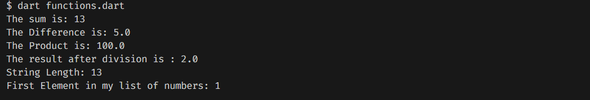

## dart-functions
**TASKS**
1. Task 1

- Write a function called addTwo that takes two numbers as arguments and returns the sum of those two numbers.

2. Task 2

- Write a function called subtractTwo that takes two numbers as arguments and returns the difference of those two numbers.

3. Task 3

- Write a function called multiplyTwo that takes two numbers as arguments and returns the product of those two numbers.

4. Task 4

- Write a function called divideTwo that takes two numbers as arguments and returns the quotient of those two numbers.

5. Task 5

- Write a function called stringLength that takes an argument of type String and returns the length of that string.

6. Task 6

- Write a function called getFirstElement that takes a list as an argument and returns the first element of that list.

## Output

